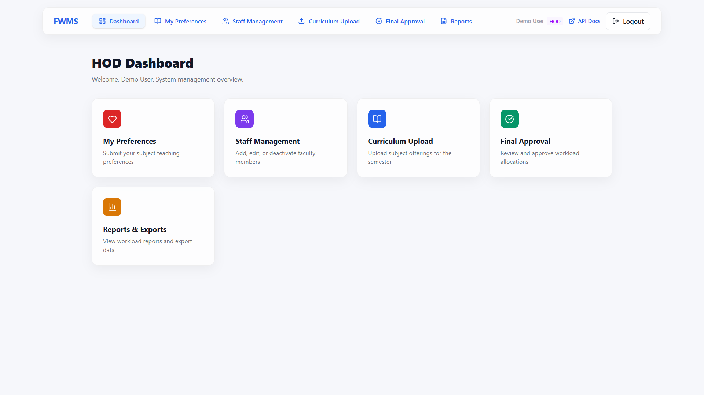
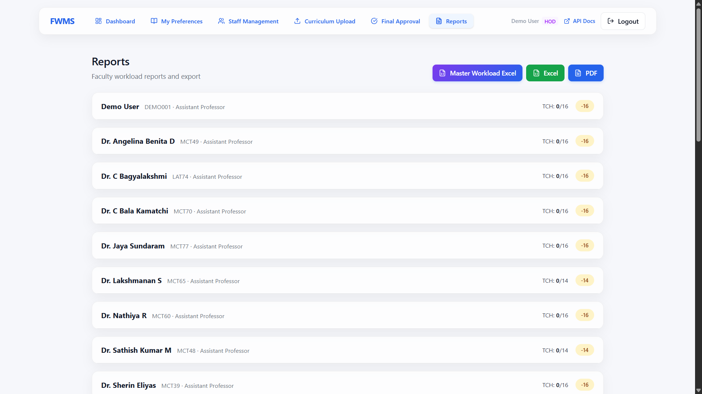
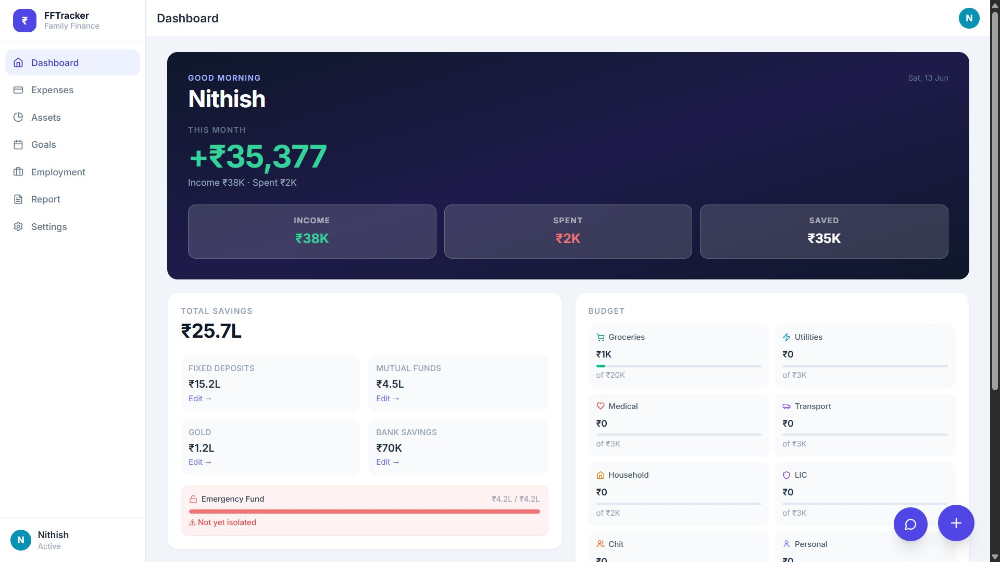
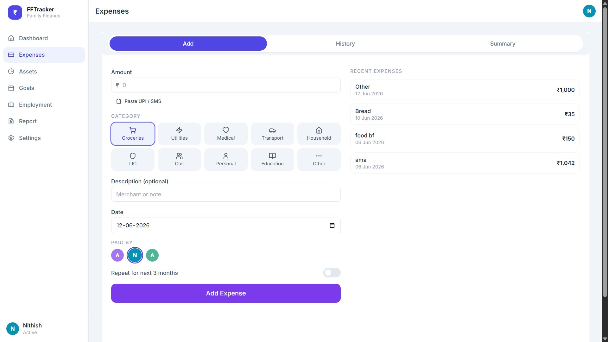
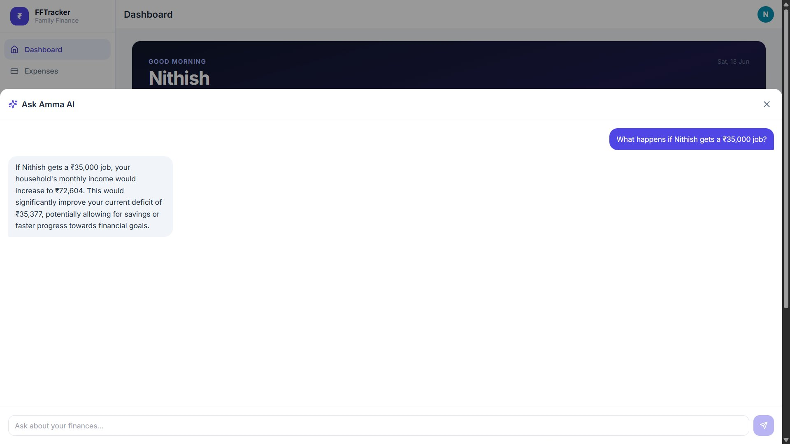

# Nithish Kumar V

**Data Analyst · Full Stack Engineer · Gen AI Builder**

---

## 🎓 Education

| Degree | Institution | CGPA |
|--------|-------------|:----:|
| **MCA** | Hindustan Institute of Technology and Science, Chennai | **8.97** |
| **BCA** | Hindustan College of Arts & Science, Chennai | **8.20** |

---

## 🚀 Projects

### 🏛️ Faculty Workload Management System (FWMS)

> **Institutionally deployed at HITS Chennai** — governing workload across 50+ faculty

| Metric | Value |
|--------|-------|
| 📚 Unique subjects managed | 112 across 4 programs |
| 👨🏫 Faculty served | 50+ |
| 🗄️ Database tables | 22 (15 core + 7 audit/legacy) |
| 📊 KPIs tracked per faculty | 15 |
| 🔌 REST API endpoints | 102 |
| 🔐 RBAC roles | 4 (Faculty · TT Coordinator · HOD · Admin) |

**Key features:**
- Rule-based allocation engine with 3-stage pipeline (First Preference → Lower Preference → Unallocated)
- Workload constraints: 14h min · 18h norm · 21.6h max (20% overload threshold)
- Excel compliance exports via openpyxl · PDF reports via reportlab
- Cycle states: `OPEN → CLOSED → ALLOCATED → FROZEN`

**Power BI Analytics Layer** — 3-page dashboard built on FWMS data:
- 40% faculty overload rate identified · 53% department workload gap flagged
- Overload/underload classification against 18-hour threshold business rule
- Department and program-level breakdowns for leadership review

**Stack:**

---

### 💰 Chit Fund Analytics

> **Authenticated financial tracking and verification platform for chit funds**

🔒 Live app requires an authorized account · [chitfund-analytics.vercel.app](https://chitfund-analytics.vercel.app)

| Financial Overview | Round Detail & Verification | Chit Structure |
|:--:|:--:|:--:|
|  |  |  |

**Key engineering decisions:**
- Append-only actual transaction ledger — no silent overwrites
- Explicit verification states: `VERIFIED_FORMULA` · `CONFIRM_SOURCE` · `MANUAL_OVERRIDE` · `FLAGGED_MISMATCH`
- ROI calculation gated by completion + completeness + verification (not estimated mid-run)
- Idempotency protection on payout recording
- 501 tests passing · 0 failing · Row-level security throughout

**Financial safety model:** Expected payment ≠ actual payment · Auction date ≠ payment date · Installment savings ≠ profit

**Stack:**

---

### 🏠 Family Finance Tracker

> **React PWA using Google Gemini to parse SMS expense messages**

🌐 Live: [family-finance-tracker-pearl.vercel.app](https://family-finance-tracker-pearl.vercel.app)

| Dashboard | Expenses | AI Chatbot |
|:--:|:--:|:--:|
|  |  |  |

- Multi-user household budgeting across 5 asset classes
- Google Gemini parses raw SMS text into structured expense records
- Offline-capable via service worker · Recharts data visualizations
- Milestone tracking · Monthly reports · Full expense history

**Stack:**

---

## 📄 Research

**"Shift-Aware Threshold Adaptation for Cross-Dataset Wearable Anomaly Detection"**
IEEE ICSCST 2026 · Co-authored with Nathiya R
- False positive rate reduced: **46.69% → 1.02%**

---

## 🏅 Certifications

| Certification | Period | Score |
|---|---|:---:|
| NPTEL Cloud Computing | Jan–Apr 2025 | **67/100** |
| NPTEL Introduction to Algorithms & Analysis | Jul–Oct 2025 | **62/100** |
| NPTEL Enhancing Soft Skills & Personality | Feb–Apr 2026 | **84/100** |
| Intellithon'25 — 24-hr National Hackathon, HITS Chennai | Oct 2025 | 🏆 |
| Practical Data Analytics using SQL & Cloud — 5-day workshop, HITS | Feb 2026 | ✅ |

---

*Portfolio built with Vite · Deployed on Vercel*

