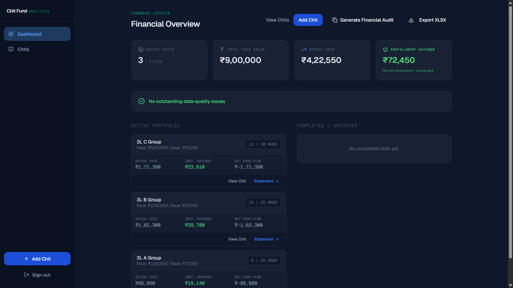
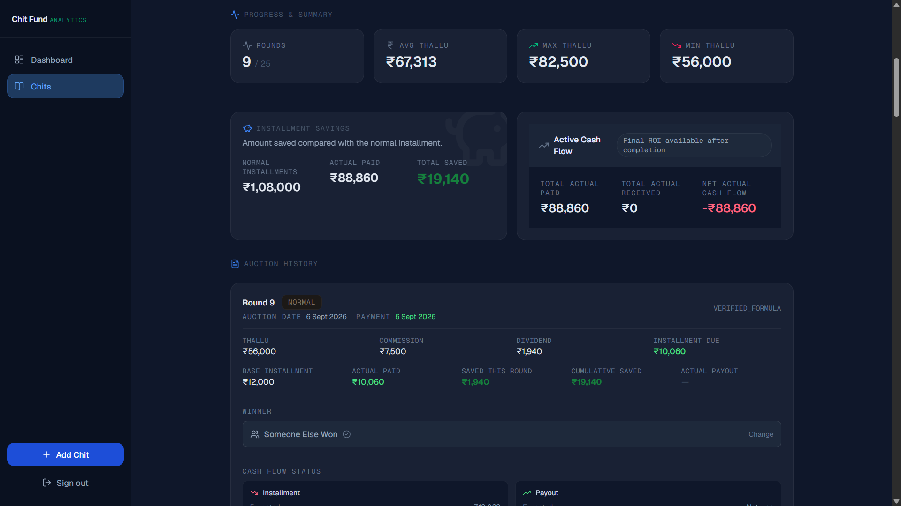
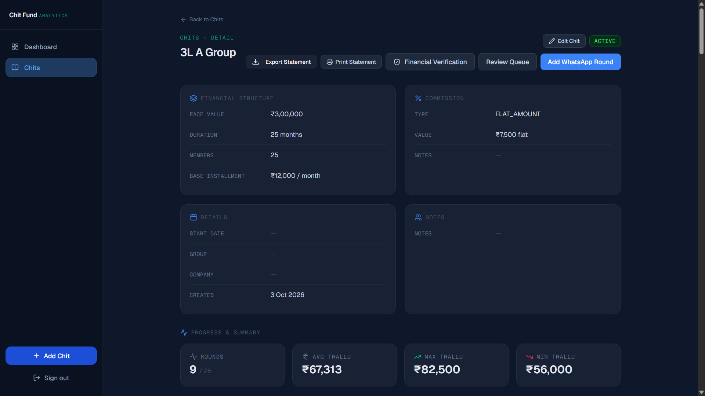

# Nithish Kumar V — Portfolio

**Data Analyst · Full Stack Engineer · Gen AI Builder**
Chennai, India · [Portfolio](https://nithish-portfolio-seven.vercel.app) · [LinkedIn](https://linkedin.com/in/nithishkumar246) · [GitHub](https://github.com/Nithish-kumar-git)

---

## 🎓 Education

| Degree | Institution | CGPA |
|--------|-------------|------|
| MCA | Hindustan Institute of Technology and Science, Chennai | **8.97** |
| BCA | Hindustan College of Arts & Science, Chennai | **8.20** |

---

## 🚀 Projects

### Faculty Workload Management System (FWMS)
> Institutionally deployed at HITS Chennai — governing workload across 50+ faculty

- 22-table PostgreSQL schema · 19,200+ course offerings automated · 15 KPIs tracked per faculty
- 4-tier RBAC · 30+ REST API endpoints · Excel compliance exports
- **Power BI Analytics Layer:** 3-page dashboard — 40% faculty overload rate and 53% department workload gap identified against an 18-hour threshold business rule

**Stack:** PostgreSQL · FastAPI · SQLAlchemy · React · TypeScript · Python · Power BI

---

### Chit Fund Analytics
> Authenticated financial tracking and verification platform for chit funds

Screenshots from the live authenticated application:

| Financial Overview | Round Detail | Chit Structure |
|---|---|---|
|  |  |  |

- Append-only actual transaction ledger with idempotency protection
- Explicit verification states: `VERIFIED_FORMULA` · `CONFIRM_SOURCE` · `MANUAL_OVERRIDE` · `FLAGGED_MISMATCH`
- ROI gated by completion, completeness, and verification requirements
- 501 tests passing · Row-level security throughout · Excel + Financial Audit exports
- 🔒 **Live (authenticated):** [chitfund-analytics.vercel.app](https://chitfund-analytics.vercel.app)

**Stack:** Next.js · TypeScript · Supabase · PostgreSQL · Tailwind CSS · Vercel · GitHub Actions

---

### Family Finance Tracker
> React PWA using Google Gemini to parse SMS expense messages

- Multi-user household budgeting across 5 asset classes
- Offline support via service worker · Recharts visualizations
- 🌐 **Live:** [family-finance-tracker-pearl.vercel.app](https://family-finance-tracker-pearl.vercel.app)

**Stack:** React · FastAPI · PostgreSQL · Gemini API · PWA

---

## 📄 Research

**"Shift-Aware Threshold Adaptation for Cross-Dataset Wearable Anomaly Detection"**
IEEE ICSCST 2026 · Co-authored with Nathiya R · False positive rate reduced from 46.69% → 1.02%

---

## 🏅 Certifications

| Certification | Score |
|---|---|
| NPTEL Cloud Computing — Jan–Apr 2025 | 67/100 |
| NPTEL Intro to Algorithms and Analysis — Jul–Oct 2025 | 62/100 |
| NPTEL Enhancing Soft Skills & Personality — Feb–Apr 2026 | 84/100 |
| Intellithon'25 — 24-hr National Hackathon, HITS Chennai (Oct 2025) | — |
| Practical Data Analytics using SQL & Cloud — 5-day workshop (Feb 2026) | — |

---

*Built with Vite · Deployed on Vercel*