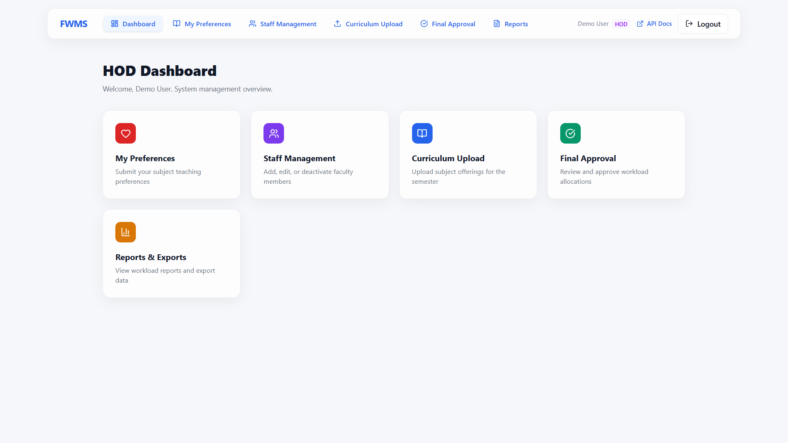

---

# Nithish Kumar V — Portfolio

**Data Analyst · Full Stack Engineer · Gen AI Builder**
Chennai, India · [nithish-portfolio-seven.vercel.app](https://nithish-portfolio-seven.vercel.app) · [LinkedIn](https://linkedin.com/in/nithishkumar246)

---

## 🎓 Education

| Degree | Institution | CGPA |
|--------|-------------|------|
| MCA | Hindustan Institute of Technology and Science, Chennai | 8.97 |
| BCA | Hindustan College of Arts & Science, Chennai | 8.20 |

---

## 🚀 Featured Projects

### Faculty Workload Management System (FWMS)
> Institutionally deployed at HITS Chennai — governing workload across 50+ faculty

- 22-table PostgreSQL platform · 19,200+ course offerings automated · 15 KPIs/faculty
- 4-tier RBAC · 30+ API endpoints · Excel compliance reports
- **Power BI Analytics Layer:** 3-page dashboard identifying 40% faculty overload rate and 53% department workload gap against an 18-hour threshold

**Stack:** PostgreSQL · FastAPI · SQLAlchemy · React · TypeScript · Python · Power BI

---

### Chit Fund Analytics
> Authenticated financial tracking and verification platform for chit funds

Real screenshots from the live application:

| Financial Overview | Round Detail & Verification | Chit Structure |
|---|---|---|
|  |  |  |

- Append-only actual transaction ledger with idempotency protection
- Explicit verification states: `VERIFIED_FORMULA` · `CONFIRM_SOURCE` · `MANUAL_OVERRIDE` · `FLAGGED_MISMATCH`
- ROI gated by completion, completeness, and verification requirements
- 501 tests passing · Row-level security throughout · Excel + Financial Audit exports
- **Live (authenticated):** [chitfund-analytics.vercel.app](https://chitfund-analytics.vercel.app) · [Source](https://github.com/Nithish-kumar-git/chitfund-analytics)

**Stack:** Next.js · TypeScript · Supabase · PostgreSQL · Tailwind CSS · Vercel · GitHub Actions

---

### Family Finance Tracker
> AI-powered PWA using Google Gemini to parse SMS expense messages

- Multi-user household budgeting across 5 asset classes
- Offline support via service workers · Recharts visualizations
- **Live:** [family-finance-tracker-pearl.vercel.app](https://family-finance-tracker-pearl.vercel.app)

**Stack:** React · FastAPI · PostgreSQL · Gemini API · PWA

---

## 📄 Research

**"Shift-Aware Threshold Adaptation for Cross-Dataset Wearable Anomaly Detection"**
IEEE ICSCST 2026 · Co-authored with Nathiya R · False positive rate reduced from 46.69% → 1.02%

---

## 🏅 Certifications

- NPTEL Cloud Computing — Jan–Apr 2025 · Score: 67/100
- NPTEL Introduction to Algorithms and Analysis — Jul–Oct 2025 · Score: 62/100
- NPTEL Enhancing Soft Skills and Personality — Feb–Apr 2026 · Score: 84/100
- Intellithon'25 — 24-hour National Hackathon, HITS Chennai · October 2025
- Practical Approaches to Data Analytics Using SQL and Cloud Services — 5-day workshop, HITS Chennai · February 2026

---

*Portfolio site built with Vite · Deployed on Vercel*

---